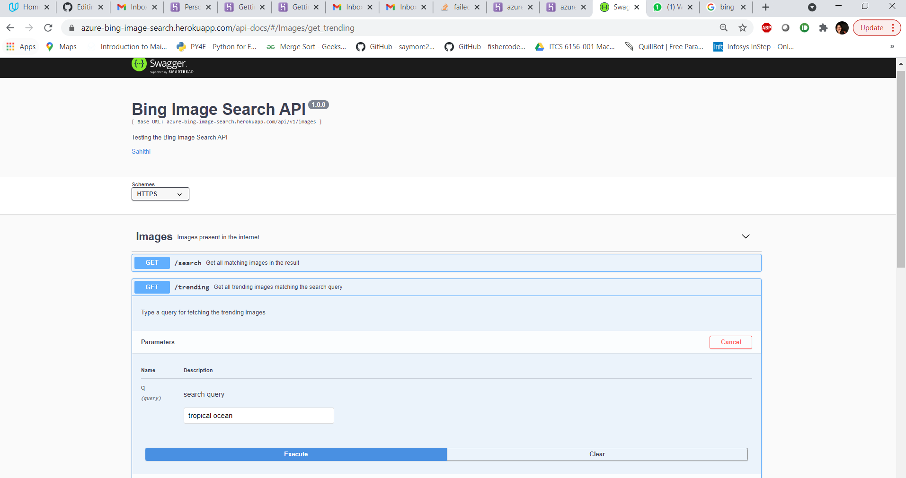

# Bing_Image_Search

## Image Search:
Image Search is the Azure Media Services AI solution and part of the Azure Cognitive Services brand. Image search we can see trending images, wallpapers, gifs and ideas on Bing everyday.Image search provides ability to extract deep insights (with no need for data analysis or coding skills) using machine learning models based on multiple channels (voice, vocals, visual).

## Implementation of Image search using our local API:
As part of the implementation of the video indexer, I have implemented 2 API requests

- GET API to get all matching search query images in the result
- GET API to get all trending images in the result matching the search query

Below are the steps provided to use the swagger implementation to retrieve the final result.

## Steps to be followed for acquiring the result from the search API:
Step 1:

- Click the URL https://azure-bing-image-search.herokuapp.com/api-docs/#/ to open swagger

Step 2:
- Please click on GET option under Images /search and then click on try-out and click on execute.

 - Related images will be displayed in the response body as below
 
 
 
 
## Steps to be followed for acquiring the result from the trending API:
Step 1:

- Click the URL https://azure-bing-image-search.herokuapp.com/api-docs/#/ to open swagger

Step 2:
- Please click on GET option under Images /trending and then click on try-out and click on execute.

 - Related trending images will be displayed in the response body as below
 
 
 

 

